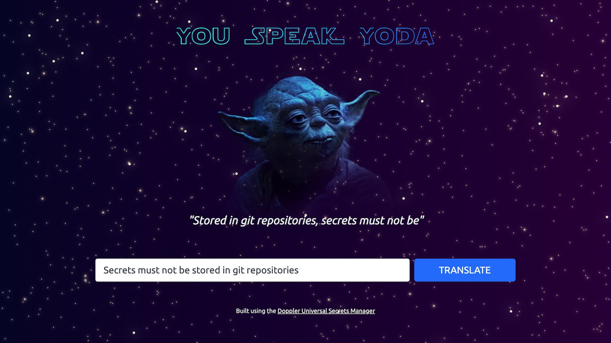

# You Speak Yoda

[](https://yodaspeak.io/)

A simple application to translate english into Yoda's version, which is mostly, back to front, or, in other words, [object–subject–verb](https://en.wikipedia.org/wiki/Object%E2%80%93subject%E2%80%93verb) word order.

It's designed to show how to use the [Doppler Universal Secrets Manager](https://doppler.com/) for securely and easily fetching secrets and application configuration via environment variables.

## Requirements

-   [Doppler CLI](https://docs.doppler.com/docs/enclave-installation)
-   Node 14+

If on macOS, you can install these by running:

```sh
brew install dopplerhq/cli/doppler node
```

## Setting up

1. Install dependencies:

```sh
npm install
```

2. Use an `.env` file initially to supply secrets and configuration:

```sh
cp sample.env .env
```

3. Run the server:

```sh
npm start
```

## Running the app using Doppler

1. [Install Doppler](https://docs.doppler.com/docs/enclave-installation)
1. From a terminal, run:

```sh
doppler login
```

1. Once logged in, open a new browser window and [sign in to Doppler](https://dashboard.doppler.com/)
1. In the Doppler Web UI, create a workspace
1. Then [create a project](https://docs.doppler.com/docs/enclave-project-setup) called `' yodaspeak`
1. Add the required secrets and configuration by uploading the contents of the `.env` file, then save.
1. In a terminal, cd into the `you-speak-yoda` directory, then run:

```sh
# Configure Doppler to fetch the `yodaspeak` secrets from the `dev` environment
doppler enclave setup
```

To check that the Doppler CLI can access the project and retrieve its secrets, run:

```sh
doppler run env | grep YODA
```

If secrets are displayed, Doppler is good to go! Now let's run the server.

> NOTE: The Yoda translation API used by the app is limited to 5 requests per hour unless you [register to purchase an API key](https://funtranslations.com/register). You can view the production site at [https://yodaspeak.io/](https://yodaspeak.io/)

Now let's use `doppler run` to call the `npm start` command, which will inject our secrets as environment variables that our app can use.

```sh
doppler run -- npm start
```

You can now access the site at [http://localhost:3000](http://localhost:3000)

## Having trouble getting the app working?

Create a GitHub issue, including your OS and Node version, and we'll help you out!
